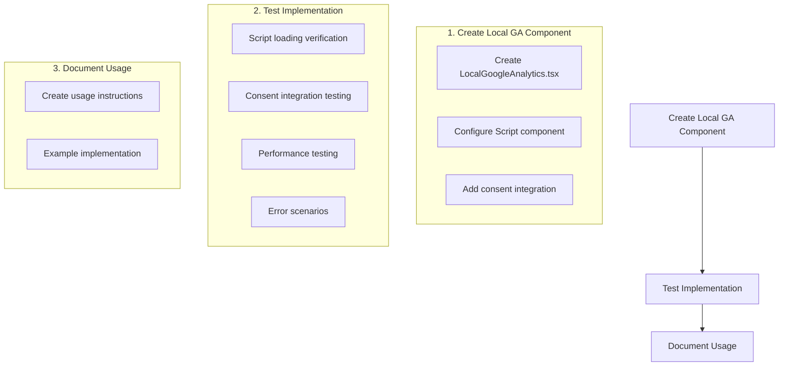

# Page-Specific Google Analytics Implementation Plan

## Overview

Add page-specific Google Analytics tracking using gtag.js to individual Next.js pages while maintaining compatibility with the existing consent management system.

## Implementation Flow



## Detailed Implementation Steps

### 1. Create Local GA Component

Create a new file `src/components/analytics/LocalGoogleAnalytics.tsx`:

```typescript
interface LocalGoogleAnalyticsProps {
  trackingId: string;
}

export function LocalGoogleAnalytics({ trackingId }: LocalGoogleAnalyticsProps) {
  // Implementation using Next.js Script component
}
```

Key Features:
- Simple props interface with trackingId
- Two Script components (gtag.js loader and initializer)
- strategy="afterInteractive" for both scripts
- Automatic integration with existing consent system

### 2. Testing Plan

#### 2.1 Script Loading Verification
- Use Chrome DevTools Network tab to verify:
  * gtag.js loads correctly
  * Loading order is correct (gtag.js before initialization)
  * script loading doesn't block page rendering
  * Both scripts have `async` attribute

#### 2.2 Consent Integration Testing
- Test with consent banner:
  * Initial page load shows banner
  * Accepting all - verify GA begins tracking
  * Rejecting all - verify GA respects preference
  * Refresh page - verify preferences persist
  * Check gtag('consent', 'update') calls

#### 2.3 Performance Testing
- Run Lighthouse audit:
  * Verify no impact on First Contentful Paint
  * Check for any render-blocking resources
  * Verify Total Blocking Time stays within limits
- Test page load with different network conditions:
  * Fast 3G
  * Slow 3G
  * Offline

#### 2.4 Error Scenario Testing
- Network failure scenarios:
  * gtag.js fails to load
  * initialization script errors
  * consent update fails
- Integration scenarios:
  * Multiple instances on same page
  * Different tracking IDs
  * Missing tracking ID

### 3. Usage Example

```typescript
import { LocalGoogleAnalytics } from '@/components/analytics/LocalGoogleAnalytics';

export default function Page() {
  return (
    <>
      <main>
        {/* Page content */}
      </main>
      <LocalGoogleAnalytics trackingId="G-ZG88VLRXYL" />
    </>
  );
}
```

## Implementation Notes

1. The component must:
   - Be lightweight and focused
   - Easy to add to individual pages
   - Compatible with existing consent system
   - Non-blocking for page load

2. Integration considerations:
   - Place component at end of page content
   - Verify no conflicts with global GA if present
   - Respect existing consent preferences
   - Handle errors gracefully

3. Performance requirements:
   - No impact on Core Web Vitals
   - No render blocking
   - Minimal bundle size impact

## Next Steps

1. Switch to code mode to implement LocalGoogleAnalytics component
2. Test implementation following detailed test plan
3. Document usage and add examples