# GDPR Consent Banner Implementation Plan

## Overview
This plan outlines the implementation of a GDPR-compliant consent banner with Google Consent Mode V2 for the Next.js 14.1.0 application.

## Component Architecture

```mermaid
flowchart TB
    subgraph FileStructure["📁 File Structure"]
        A["/src/components/consent/ConsentBanner.tsx"] --> B["/src/components/consent/types.ts"]
        A --> C["/src/components/consent/hooks/useConsent.ts"]
        A --> D["/src/components/consent/utils.ts"]
    end

    subgraph DataFlow["🔄 Data Flow"]
        E[["Initial Load"]] --> F{"Check localStorage"}
        F -->|Not Found| G["Show Banner"]
        F -->|Found| H["Hide Banner"]
        G --> I{"User Choice"}
        I -->|"Accept All"| J["Set Analytics Granted"]
        I -->|"Reject All"| K["Set Analytics Denied"]
        J & K --> L["Save to localStorage"]
        L --> H
    end

    subgraph Integration["🔌 Integration"]
        M["Add to layout.tsx"] --> N["Wrap in ClientComponent"]
        N --> O["Position Fixed Bottom"]
    end
```



## File Structure & Components

1. **Types Definition** (`/src/components/consent/types.ts`)
```typescript
interface ConsentState {
  analytics_storage: 'granted' | 'denied';
  ad_storage: 'granted' | 'denied';
}

interface ConsentBannerProps {
  className?: string;
}
```

2. **Custom Hook** (`/src/components/consent/hooks/useConsent.ts`)
- State management using React.useState
- LocalStorage interaction
- Google Analytics consent updates
- Type-safe consent state management

3. **Utilities** (`/src/components/consent/utils.ts`)
- LocalStorage helpers
- Consent state validation
- Google Analytics wrapper functions

4. **Main Component** (`/src/components/consent/ConsentBanner.tsx`)
- Client-side component with fade-in animation
- Responsive design using Tailwind CSS
- Light/Dark mode support via theme context
- Error boundary integration

## UI Design

```
+------------------------------------------+
|                                    [✕]    |
| 🔒 We value your privacy                  |
|                                          |
| We use cookies to enhance your browsing  |
| experience and analyze site traffic.     |
|                                          |
| [    Accept All    ] [    Reject All    ]|
+------------------------------------------+
```

### Styling Specifications
- Rounded corners: `rounded-2xl`
- Shadow: `shadow-lg`
- Animation: `animate-fade-in`
- Dark mode: Uses theme context
- Position: Fixed bottom with safe area padding
- Responsive: Full width on mobile, max-width on desktop

## Integration Steps

1. **Layout Integration**
```tsx
// In src/app/layout.tsx
<ConsentBanner />
```
- Add just before closing body tag
- Ensure client-side rendering
- Maintain existing layout structure

2. **Google Analytics Integration**
- No modification to existing GA setup needed
- Consent mode handled via hook
- Default to 'denied' until user grants consent

## Technical Considerations

1. **Performance**
- Component lazy-loading
- Minimal bundle size impact
- Efficient localStorage operations

2. **Accessibility**
- ARIA labels
- Keyboard navigation
- High contrast support

3. **Error Handling**
- Graceful fallback if storage unavailable
- Type safety throughout
- Error boundary implementation

4. **Testing Strategy**
- Unit tests for hook logic
- Integration tests for GA interaction
- Visual regression tests for theme support

## Implementation Sequence

1. Create type definitions
2. Implement useConsent hook
3. Create utility functions
4. Build ConsentBanner component
5. Add integration tests
6. Integrate with layout
7. Test end-to-end functionality

## Safety Measures

1. **Error Prevention**
- TypeScript strict mode
- PropTypes validation
- Storage availability checks

2. **User Experience**
- No content shifts
- Smooth animations
- Clear action buttons

3. **Integration Safety**
- No conflicts with existing GA
- Preserves existing layout
- Handles SSR properly